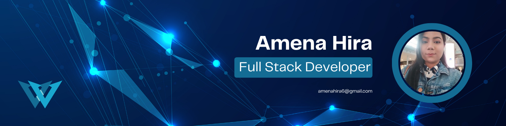

<!-- Banner -->

 

<h1 align="center">Hi 👋, I'm Amena Akhter Hira</h1>
<h3 align="center">A Passionate Full Stack Developer</h3>

<table>
  <tr>
    <td width="60%" valign="middle">

## 👩‍💻 About Me

I'm a passionate **Full Stack Developer** who enjoys building modern, responsive, and user-friendly web applications. I love exploring new technologies, solving problems, and continuously improving my development skills.

- 🌱 I’m currently learning **Python**
- 🚀 I’m currently exploring new technologies and improving my **Full Stack Development** skills
- 💬 Ask me about **React, MERN Stack, Java & Spring Boot**
- 📍 Location: **Paris, France**
- 📫 Reach me at **amenahira6@gmail.com**
- ⚡ Fun fact: **I love coding and exploring new technologies**

  </td>

  <td width="40%" align="center" valign="middle">
    
  </td>
  </tr>
</table>

## 🤝 Connect With Me

  
  
  

## 🛠️ Technology Stack

### Languages

  

### Frontend

  

### Backend

  

### Database & Model

  

### Deployment Platforms

  

### Tools & Technologies

  

## 📊 GitHub Stats

  

